# Scout — Account discovery depuis une URL

> Module Revenue Engineering pour **Konsole**, le SaaS de **Youno**.
> Donnez une URL, Scout retourne un brief commercial exploitable en quelques secondes.

- **Application** : https://youno-scout.vercel.app
- **Code source** : [HamzaNADIFI07/Youno-Scout](https://github.com/HamzaNADIFI07/Youno-Scout)

---

## Table des matières

1. [Vision produit](#1-vision-produit)
2. [Fonctionnalités](#2-fonctionnalités)
3. [Architecture globale](#3-architecture-globale)
4. [Stack technique et choix justifiés](#4-stack-technique-et-choix-justifiés)
5. [Workflow Mode Standard](#5-workflow--mode-standard)
6. [Workflow Mode Premium](#6-workflow--mode-premium)
7. [Système multi-provider LLM](#7-système-multi-provider-llm)
8. [Garde-fou anti-bullshit (validation IA)](#8-garde-fou-anti-bullshit-validation-ia)
9. [APIs externes optionnelles](#9-apis-externes-optionnelles)
10. [Scoring ICP explicable](#10-scoring-icp-explicable)
11. [Gate email & double opt-in](#11-gate-email--double-opt-in)
12. [Sécurité de session (cookie HMAC)](#12-sécurité-de-session-cookie-hmac)
13. [Observabilité et logs](#13-observabilité-et-logs)
14. [Sécurité applicative](#14-sécurité-applicative)
15. [Base de données](#15-base-de-données)
16. [Structure du repo](#16-structure-du-repo)
17. [Lancer en local](#17-lancer-en-local)
18. [Migrations](#18-migrations)
19. [Déploiement Vercel](#19-déploiement-vercel)
20. [Variables d'environnement](#20-variables-denvironnement)
21. [Tester l'API directement](#21-tester-lapi-directement)
22. [Limites actuelles](#22-limites-actuelles)
23. [Pistes d'amélioration](#23-pistes-damélioration)
24. [Pertinence pour Konsole](#24-pertinence-pour-konsole)

---

## 1. Vision produit

Scout part d'une intuition simple : **avant d'envoyer un cold email à une boîte, un SDR/AE veut comprendre la boîte en 30 secondes**. Pas en passant 10 minutes sur le site, pas en jonglant entre 4 outils — un seul rapport synthétique.

Scout prend une URL, applique **trois couches d'analyse** complémentaires (scraping + APIs publiques + LLM), et retourne :

- Un brief commercial (nom, proposition de valeur, ICP cible, modèle économique, taille estimée)
- La stack technique détectée (~50 outils dans 6 catégories)
- Des signaux GTM (10 prédéfinis ou générés sur-mesure par l'IA)
- Les contacts publics + personnes mentionnées sur le site
- Les infos juridiques extraites des mentions légales
- Un **score ICP 0-100 explicable**, décomposé par catégorie

L'app a **deux modes**, parce que tous les utilisateurs n'ont pas le même besoin :

| Mode | Pour qui | Signaux |
|---|---|---|
| **Standard** | Setup rapide, démo, prospection générique | 10 signaux GTM prédéfinis (CRM, tracking, funding…) |
| **Premium** | Equipes avec un ICP très spécifique | L'utilisateur décrit son business, l'IA génère 8-12 signaux sur-mesure éditables en langage naturel |

### Une intention produit explicite : Engineering as Marketing

Scout n'est pas qu'un outil utilitaire. C'est aussi pensé comme un **micro-produit d'acquisition B2B** pour Youno — une tactique d'acquisition appelée **Engineering as Marketing**[^em] : offrir un petit outil gratuit utile pour transformer des visiteurs anonymes en leads qualifiés. C'est exactement ce que HubSpot a fait avec son Website Grader[^hubspot], un mini-outil SEO gratuit qui a généré des millions de leads depuis 2007 et reste l'un de leurs principaux canaux d'acquisition.

C'est pour cette raison que Scout impose une **gate email avec double opt-in** avant d'afficher le rapport (mode Standard). La justification stratégique complète est détaillée [section 11](#11-gate-email--double-opt-in).

---

## 2. Fonctionnalités

### Mode Standard (par défaut)

- Sélection libre parmi 10 signaux GTM (toggle on/off)
- Activation au choix de 3 APIs publiques (Clearbit Logo, Hunter, CompanyEnrich)
- **Gate email avec double opt-in** avant la première analyse
- Score ICP explicable (référence "SaaS B2B mid-market")
- Extraction des personnes nommées sur la home (fondateurs, équipe, témoignages)
- Crawl bordé des mentions légales (jusqu'à 3 pages, 29 patterns FR/EN/DE/IT/ES/NL)

### Mode Premium

- Description libre de votre offre + ICP + signaux d'achat + anti-signaux
- Génération IA de 8-12 signaux GTM personnalisés (forme noun-phrase industrie)
- Édition de la liste en **langage naturel** ("retire le signal X", "ajoute un signal sur Notion")
- **Garde-fou anti-bullshit** : si la description est inexploitable, l'IA refuse explicitement
- Sélection d'APIs externes à activer pour l'analyse

### Couche transverse

- **Multi-provider LLM avec fallback intelligent** : Groq → Mistral → Gemini → OpenRouter
- **Spécialisation par tâche** : Mistral Large pour l'analyse FR profonde, Groq Llama pour le tool calling rapide
- **Cookie httpOnly signé HMAC-SHA256** pour la session (pas de localStorage)
- Logs serveur structurés (sans exposer de secrets)
- Messages d'erreur sanitizés côté UI (jamais de stack trace ou JSON brut au user)

---

## 3. Architecture globale

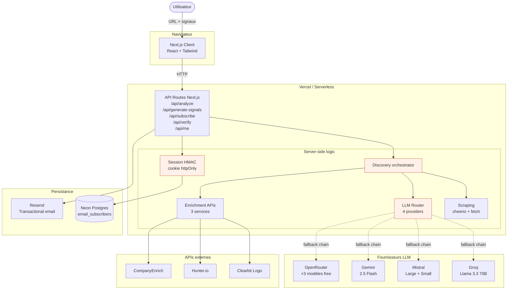

**Principe directeur** : tout ce qui peut être fait **de manière déterministe** (extraction HTML, détection de patterns, scoring, mentions légales) reste **hors LLM**. Le LLM est réservé à ce pour quoi il excelle vraiment : transformer du texte non structuré en JSON structuré (brief, signaux personnalisés).

---

## 4. Stack technique et choix justifiés

| Couche | Choix | Pourquoi |
|---|---|---|
| **Framework** | Next.js 16 (App Router) + Turbopack | Front + API routes dans un seul déploiement, RSC pour rendu léger, déploiement Vercel zéro-config |
| **Langage** | TypeScript strict | Types partagés API ↔ UI, moins de bugs runtime |
| **Validation** | Zod | Schémas réutilisés serveur (validation requêtes + outputs LLM) et typage |
| **Styles** | Tailwind CSS v4 | Itération rapide, design system cohérent, output minimal |
| **Composants** | shadcn/ui + base-ui | Composants accessibles copiés dans le repo, pas de dépendance UI lourde |
| **Scraping** | `cheerio` + `fetch` natif | Léger, mature, suffisant pour parser le HTML rendu côté serveur |
| **LLM** | **4 fournisseurs** via OpenAI-compatible API | Fallback automatique sur saturation free-tier — détaillé section 7 |
| **Email** | Resend SDK | API moderne, free tier 3 000/mois, déjà familier des équipes growth |
| **Base de données** | Neon Postgres serverless | Free tier 0.5 Go, compatible avec l'edge, latence faible |
| **Driver DB** | `@neondatabase/serverless` | Optimisé HTTP fetch, marche avec Vercel serverless |
| **Sessions** | Cookie HMAC-SHA256 maison | Pas de dépendance lourde (jose, next-auth), contrôle total sur la sécurité |
| **Hébergement** | Vercel | Free tier suffisant, env vars faciles, cohérent avec Next.js |

### Pourquoi pas...

- **Pas de Drizzle/Prisma** : pour un seul modèle (`email_subscribers`), un client SQL brut suffit et garde le bundle léger
- **Pas de next-auth** : on n'a pas besoin de OAuth/JWT complets, juste un cookie signé pour le gate email
- **Pas de Playwright/Firecrawl** : free tiers limités, le cheerio simple gère 80 % des cas (mentionné en limites)
- **Pas de Redis/cache** : version 1, on n'a pas besoin de mise en cache pour la démo. Vercel KV s'ajoute facilement plus tard.

---

## 5. Workflow : Mode Standard

Le mode standard est le parcours rapide : URL → résultat en ~10 secondes.

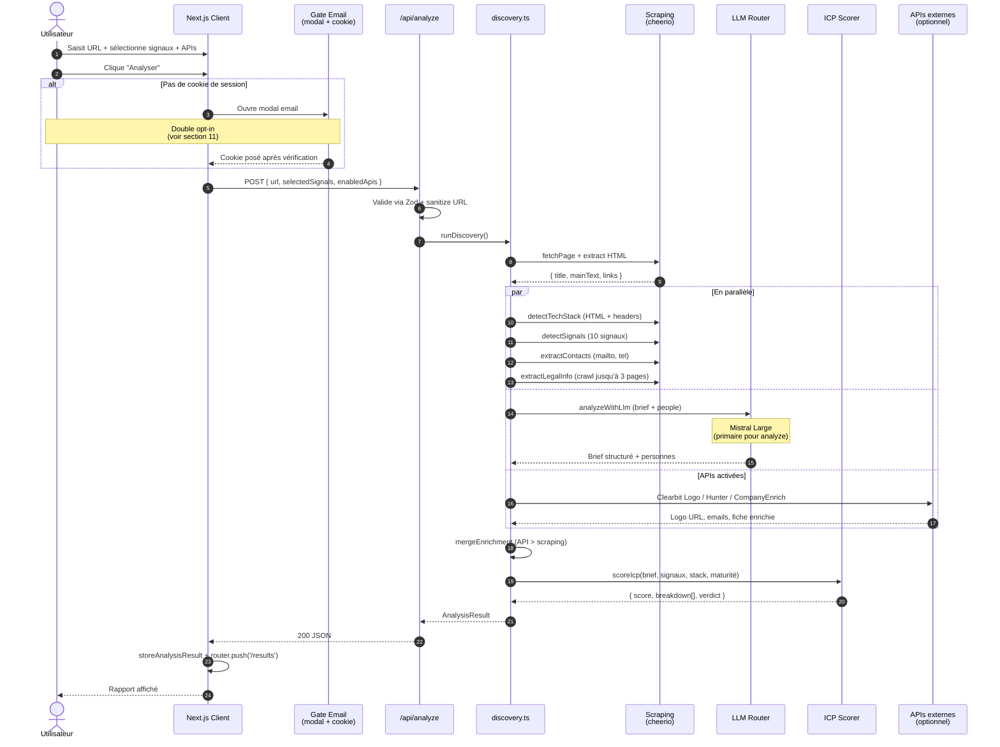

**Détails clés** :

- **Étape 6 (Scraping)** : fetch HTML avec timeout 8s, taille max 2 Mo, normalisation URL (rejet des `localhost`, IPs locales)
- **Étape 8 (LLM)** : appel **avec function calling** (`submit_company_brief`) → garantit un JSON valide
- **Étapes 7-10 en parallèle** : les calls indépendants s'exécutent en `Promise.all()` → latence ~10s au lieu de ~20s en séquentiel
- **Étape 11 (Merge)** : si CompanyEnrich a retourné le nom de l'entreprise, il prime sur la version scrapée. Pareil pour Hunter sur les emails

---

## 6. Workflow : Mode Premium

Le mode Premium ajoute une étape de configuration de signaux sur-mesure via l'IA.

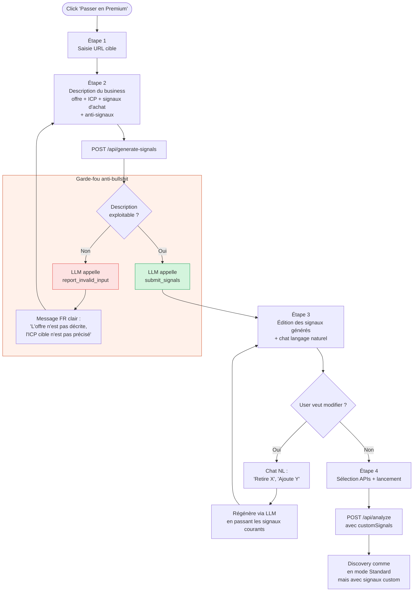

**Forme des signaux générés** : ils suivent le **standard B2B prospection** (style Clearbit/Apollo/Cognism), pas la 1ère personne. Exemples : `"Recrute Head of RevOps"`, `"Utilise HubSpot"`, `"Levée Series A récente"`. Cette convention est verrouillée dans le `SYSTEM_PROMPT` du générateur ([src/server/llm/signals-generator.ts](src/server/llm/signals-generator.ts)).

---

## 7. Système multi-provider LLM

C'est l'une des pièces les plus différenciantes de Scout. Plutôt que de dépendre d'un seul fournisseur (qui peut saturer en free tier), Scout enchaîne 4 providers avec une logique de fallback.

### Pourquoi 4 fournisseurs ?

Les free tiers LLM ont chacun leurs limites (par jour, par minute, ou en tokens). Pour rester disponible en production sans coût récurrent, on combine plusieurs fournisseurs : **3 quotas indépendants + 1 pool de modèles partagé = ~99 % de disponibilité** sans toucher un centime.

### Spécialisation par tâche

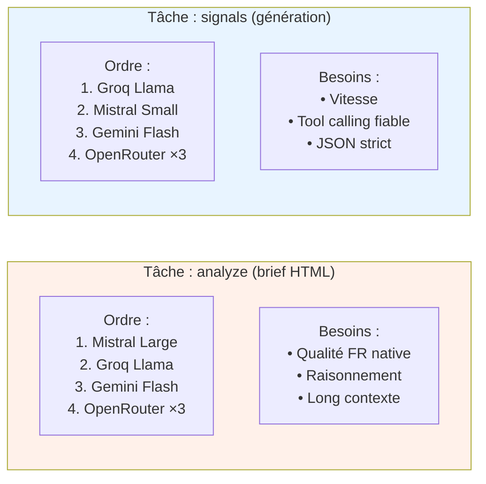

### Chaîne de fallback par tâche

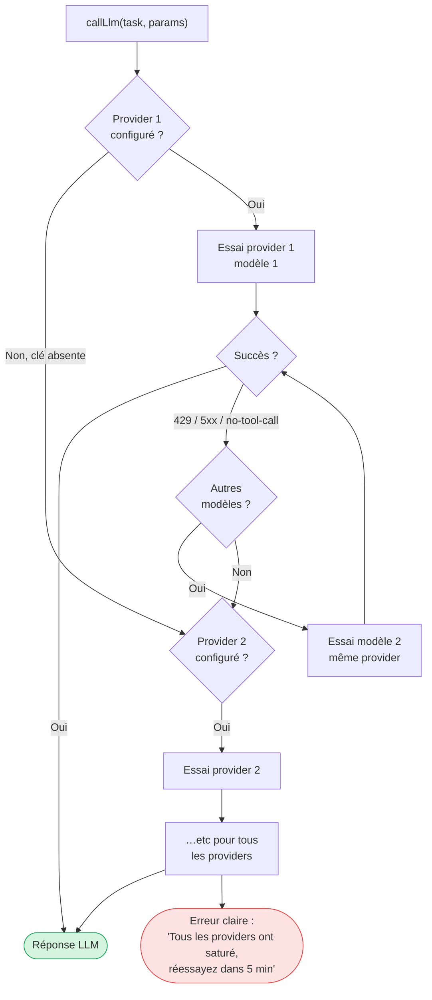

### Tableau de spécialisation

| Provider | Modèle `analyze` | Modèle `signals` | Force | Free tier |
|---|---|---|---|---|
| **Groq** | `llama-3.3-70b-versatile` | `llama-3.3-70b-versatile` | Vitesse extrême (~200ms), tool calling très fiable | 14 400 req/jour, 100k tokens/jour |
| **Mistral** | `mistral-large-latest` | `mistral-small-latest` | Modèle natif FR, qualité analyse > Llama en français | 500k tokens/min, 1 Mo tokens/mois (Experiment) |
| **Gemini** | `gemini-2.5-flash` | `gemini-2.5-flash` | Quota séparé, 1M context | 1M tokens/jour |
| **OpenRouter** | 3 modèles free en cascade : Llama 3.3 → Qwen3 80B → DeepSeek V4 | Idem | Filet ultime, plusieurs essais auto | Free pool partagé (intermittent) |

### Quirks par provider

Le code gère plusieurs quirks pour fournir une API uniforme :

- **Mistral n'accepte pas `tool_choice: "required"`** → on traduit en `"any"` (leur valeur équivalente)
- **Mistral renvoie les tool calls SANS `type: "function"`** → notre parser accepte les tool calls quand `type` est `undefined`
- **Gemini refuse les schémas JSON complexes** ("too many states for serving" sur `minItems`/`maxItems`/`minimum`/`maximum`) → on strippe ces contraintes uniquement pour Gemini, les autres providers gardent le schéma complet

Tout est dans [src/server/llm/providers.ts](src/server/llm/providers.ts).

### Logs serveur

Chaque appel logge le provider effectif :

```
[llm] task=signals provider=groq model=llama-3.3-70b-versatile
[llm] task=signals provider=groq failed (quota/429), trying next
[llm] task=signals provider=mistral model=mistral-small-latest (fallback)
```

---

## 8. Garde-fou anti-bullshit (validation IA)

**Le problème** : si l'utilisateur écrit `"asdfasdf qwerqwer zzzz"` dans le textarea, un LLM "trop serviable" va inventer 10 signaux génériques inutilisables. Mauvais signal envoyé au prospect, mauvais score, mauvaise impression.

**La solution** : le LLM a accès à **deux outils**, et choisit lequel appeler :

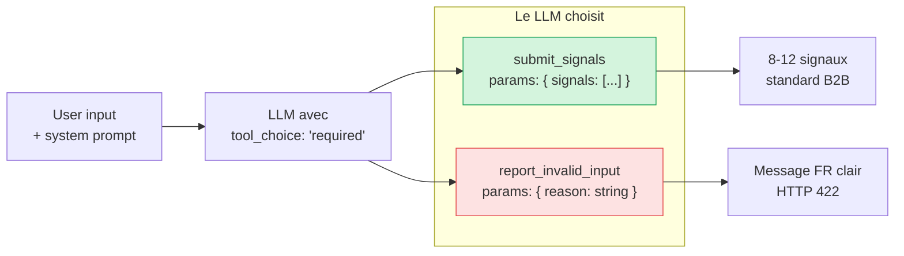

Le prompt définit explicitement les cas de rejet :

- Pur gibberish (`"asdfasdf"`, texte aléatoire)
- Description trop vague sans aucun élément spécifique
- Instruction inintelligible en mode édition

Le LLM peut renvoyer une **raison française précise** qui s'ajoute au message utilisateur. Exemple réel :

> "Votre description ne contient pas assez d'informations exploitables pour générer des signaux pertinents. Précisez votre offre, votre ICP cible et les signaux d'achat que vous cherchez à détecter. *(L'offre n'est pas décrite et l'ICP cible n'est pas précisé)*"

Cf [src/server/llm/signals-generator.ts](src/server/llm/signals-generator.ts) (sections `INPUT QUALITY CHECK` du prompt + parsing du `toolCall.name`).

---

## 9. APIs externes optionnelles

L'utilisateur active les APIs au cas par cas via 3 checkboxes dans l'UI.

| API | Endpoint | Effet sur le rapport | Free tier |
|---|---|---|---|
| **Clearbit Logo** | `https://logo.clearbit.com/{domain}` (HEAD) | Remplace le favicon scrapé par un logo HD dans le `CompanyHeader` | Illimité, pas de clé requise |
| **Hunter.io** | `api.hunter.io/v2/domain-search` | Section "Hunter" dans `EnrichmentCard` : emails publics du domaine + département | 25 lookups/mois |
| **CompanyEnrich** | `api.companyenrich.com/companies/enrich` | Section "CompanyEnrich" : taille, fondation, localisation, LinkedIn, Twitter | 50 lookups/jour |

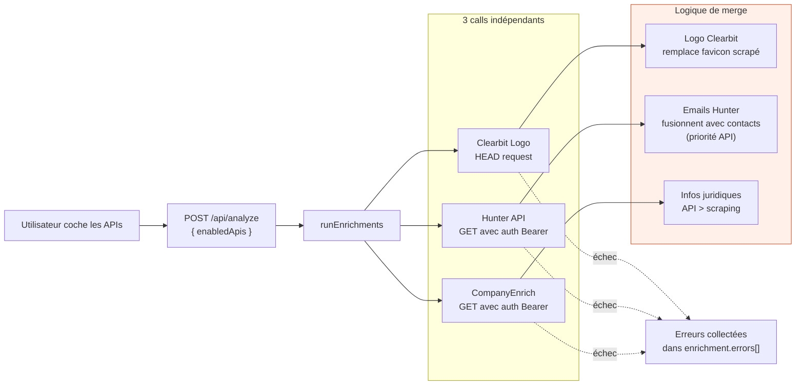

**Principe de merge** : les données API prennent **toujours le pas** sur les données scrapées (plus fiables, plus structurées). Mais le scraping reste actif en parallèle : si une API est désactivée ou tombe en erreur, le rapport reste utilisable grâce au fallback.

Une API qui échoue (clé manquante, quota dépassé, 404) **ne fait jamais planter l'analyse** — l'erreur est capturée et listée dans `enrichment.errors[]`, visible en bas de la `EnrichmentCard`.

---

## 10. Scoring ICP explicable

Le score ICP de référence est **"SaaS B2B mid-market"**, sur 100 points.

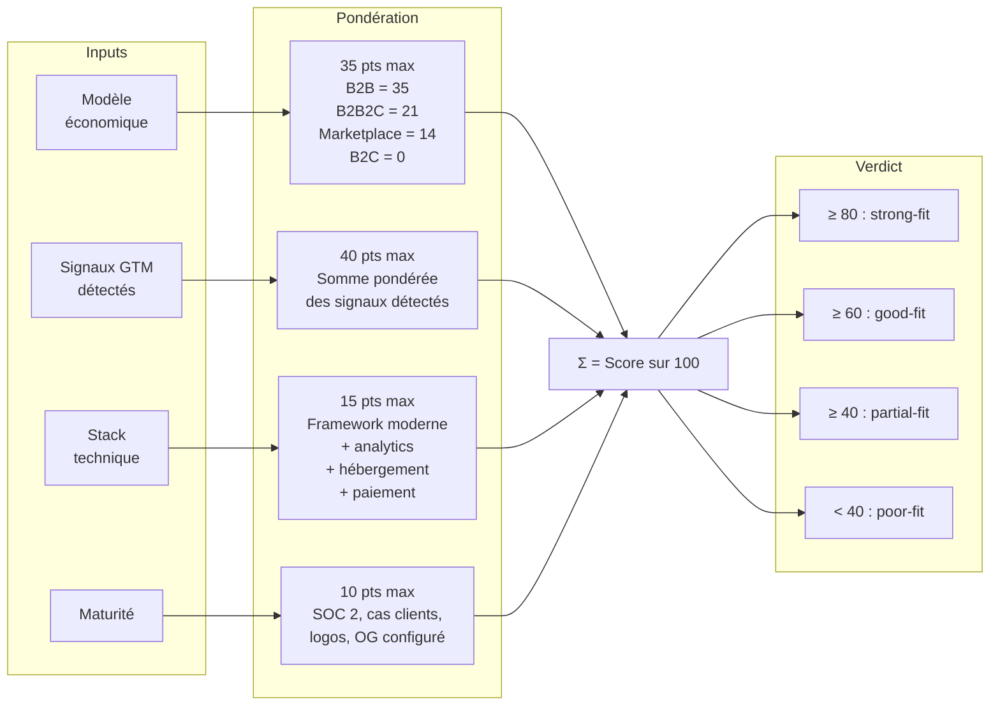

**Tous les critères et leur justification sont retournés dans la réponse**, ce qui rend le score explicable côté UI : on voit le détail catégorie par catégorie avec un raisonnement court. Voir [src/server/scoring/icp-scorer.ts](src/server/scoring/icp-scorer.ts).

---

## 11. Gate email & double opt-in

> **Note produit** : la gate email **n'est pas une friction technique** subie par l'utilisateur. C'est une **décision produit délibérée** qui transforme Scout en machine à générer des leads qualifiés pour Youno. Cette section explique d'abord le **pourquoi stratégique**, puis le **comment technique**.

### 11.1 Pourquoi cette gate : Engineering as Marketing

Avant la première analyse, l'utilisateur doit confirmer son adresse email. Pourquoi ne pas afficher directement le rapport ? Parce que Scout est conçu comme un outil **Engineering as Marketing**[^em] — une tactique consistant à offrir un mini-outil utilitaire gratuit pour attirer et qualifier des leads B2B. Le HubSpot Website Grader[^hubspot] en est l'exemple canonique : un test SEO gratuit lancé en 2007 qui reste aujourd'hui un des principaux canaux d'acquisition de HubSpot. Stripe, Drift, Notion, Clay l'utilisent tous sous des formes différentes.

Appliqué à Scout, ce choix produit a **quatre effets stratégiques** que Youno peut directement exploiter :

#### Effet 1 — Convertir un visiteur anonyme en lead identifié (TOFU → MOFU)

Un outil gratuit en libre accès attire du trafic en haut du tunnel (Top of Funnel). Sans capture d'email, le visiteur reste un Bounce Rate dans Google Analytics — invisible, inactionnable. **En posant une gate email avant le rapport, Scout transforme instantanément un visiteur en lead qualifié** stocké dans la base Neon, puis sync-able vers HubSpot ou Cargo via un webhook. C'est la solution structurelle au "pipeline sec" que vivent beaucoup d'équipes outbound.

#### Effet 2 — Capturer un Intent Signal très fort

L'approche Youno repose sur le **Signal-Based Outbound** : ne contacter que les comptes qui montrent des signaux d'achat[^6sense]. Or, quelqu'un qui prend la peine de taper une URL pour analyser les **signaux GTM** d'une entreprise envoie lui-même un signal très clair :

- Soit il analyse un concurrent → il bosse sur son positionnement / sa veille
- Soit il analyse un prospect → il fait du compte qualifié / de l'outbound
- Soit il analyse sa propre boîte → il veut comprendre ce que les outils voient de lui

Dans les **3 cas**, c'est un profil GTM/RevOps avec un besoin actif. Le moment idéal pour déclencher une notification Slack à un commercial ("Hamza vient d'analyser stripe.com sur Scout, score ICP = 87").

#### Effet 3 — Activer l'enrichissement et le Fit Score

L'email seul a peu de valeur. L'email **professionnel** est l'entrée d'un workflow d'enrichissement complet : avec un email comme `hamza@cargo.so`, un outil comme **Clay**[^clay] ou Pronto peut, en quelques secondes, retourner :

- La taille de Cargo (employés, ARR estimé)
- Le secteur, la techno utilisée
- Le poste de Hamza (LinkedIn lookup)
- Le tour de table récent
- Les concurrents directs

Avec ces données, le Fit Score peut être calculé automatiquement et le lead est **routé en priorité** si l'entreprise matche l'ICP de Youno. C'est exactement la promesse RevOps de Konsole.

#### Effet 4 — Onramp vers Konsole (Product-Led Growth)

Scout, dans sa version actuelle, est un **micro-module** de Konsole. C'est volontaire : le visiteur découvre la valeur grâce à un outil gratuit, vit son moment "Aha"[^aarrr] dès que le score ICP s'affiche, puis devient bien plus facile à convertir vers l'offre complète (PROPULSE / Konsole) — c'est la définition même du Product-Led Growth[^plg]. Le PLG est devenu en 2024 le canal d'acquisition n°1 chez 58% des éditeurs SaaS B2B selon le rapport annuel OpenView[^openview].

### 11.2 Le flow utilisateur

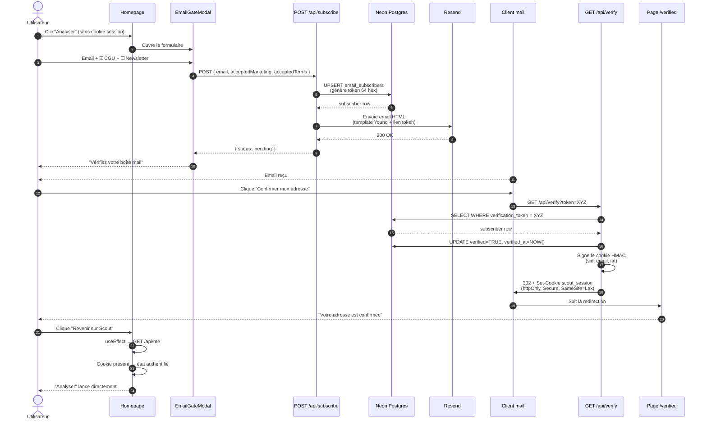

### 11.3 Effet de bord favorable : protection des coûts LLM

La gate produit un effet de bord bienvenu côté infra : chaque appel LLM coûte des tokens (même si on est sur free tier, le quota journalier est fini). En obligeant un email vérifié avant l'analyse, Scout limite naturellement les abus type "1000 appels API en bot anonyme".

### 11.4 Email HTML (template Youno)

Le template ([src/server/subscribers/email.ts](src/server/subscribers/email.ts)) reprend fidèlement la charte Youno :

- Palette `#F5F5EC` (fond beige) / `#CC532B` (orange) / `#231312` (brun sombre)
- Fonts Instrument Sans (titres) + DM Sans (corps)
- Logo Youno officiel en en-tête (PNG hébergé dans `public/youno-logo.png`)
- CTA arrondi orange avec bordure brune
- Footer "Scout — un module Konsole / Youno. You know. We build."

---

## 12. Sécurité de session (cookie HMAC)

**Choix architectural** : pas de localStorage, pas de JWT externe, pas de next-auth. Juste un **cookie httpOnly signé HMAC-SHA256** maison, court et auditable.

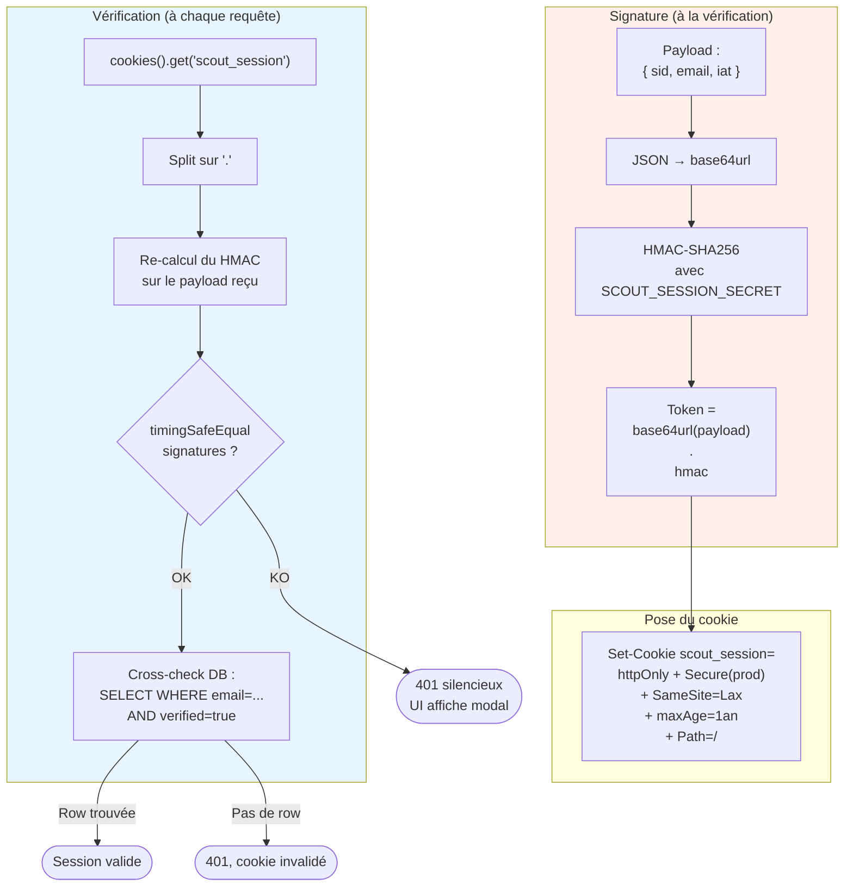

### Pourquoi HMAC et pas JWT ?

- HMAC est **suffisant** pour notre cas (pas besoin de claims complexes, pas d'inter-services)
- Pas de dépendance externe (`crypto` builtin Node)
- Plus petit en taille de payload
- Plus rapide à signer/vérifier (~10× plus rapide qu'un JWT signé RS256)

### Garanties

| Attaque | Protection |
|---|---|
| XSS lit la session | `httpOnly` : JS ne peut pas accéder au cookie |
| Tampering / forgerie | Signature HMAC avec secret 96 chars hex (génération via `crypto.randomBytes(48)`) |
| MITM | `Secure` en prod (HTTPS only) |
| CSRF | `SameSite=Lax` : pas envoyé sur cross-site POST |
| Timing attack sur la comparaison | `timingSafeEqual` au lieu de `===` |
| Session orpheline (DB reset, user supprimé) | Cross-check à chaque appel `/api/me` |

Voir [src/lib/session.ts](src/lib/session.ts).

---

## 13. Observabilité et logs

Les logs serveur sont structurés (`pino`), corrélés par requête (`x-request-id`), et conçus pour être directement consommables par un service externe (Axiom, Datadog, Better Stack…) via les **Vercel Log Drains** — sans une ligne de code supplémentaire en production.

### Architecture des logs

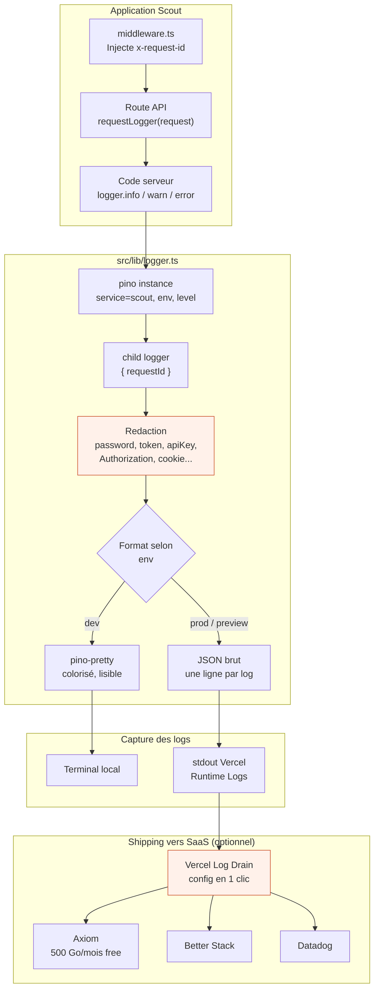

### Stack de logging

| Composant | Choix | Pourquoi |
|---|---|---|
| **Logger** | `pino` | Le plus rapide en Node (~5× plus rapide que winston), JSON natif, faible empreinte mémoire |
| **Format dev** | `pino-pretty` | Colorisation + timestamps lisibles + indentation des champs |
| **Format prod** | JSON brut sur stdout | Format universel, capté par toute infra serverless |
| **Corrélation** | `x-request-id` via Next.js middleware | UUID auto-généré ou propagé depuis le client, injecté dans le `child logger` de chaque requête |
| **Shipping prod** | Vercel Log Drains | Configuration en 1 clic dans la console Vercel, aucun code |
| **Redaction** | `pino.redact` paths | Sécurité défense en profondeur : si jamais un champ sensible se glisse dans un log, il est censuré côté pino |

### Niveaux et environnements

| Variable | Dev (par défaut) | Preview Vercel | Production |
|---|---|---|---|
| `LOG_LEVEL` | `debug` | `info` | `info` |
| Format | `pino-pretty` (terminal) | JSON | JSON |
| Transport | stdout local | stdout Vercel | stdout Vercel |

`LOG_LEVEL` peut être surchargée à chaud via la variable d'environnement (par ex. pour passer en `debug` temporairement en production sans redéploiement).

### Conventions

Chaque log d'API a :
- **Un message** court et impératif : `"analyze success"`, `"llm provider exhausted"`
- **Des champs structurés** typés : `provider`, `task`, `model`, `subscriberId`, `durationMs`, `icpScore`
- **L'objet erreur** sous la clé `err` (sérialisé proprement par `pino.stdSerializers.err` — stack, code, message, cause)
- **Le `requestId`** automatiquement injecté par le `requestLogger(request)` du middleware

### Exemple de log production

```json
{
  "level": 30,
  "time": 1716737531421,
  "service": "scout",
  "env": "production",
  "requestId": "f2a7e3b1-9c8e-4d5a-a2b1-1c4f5e6d7a8b",
  "task": "signals",
  "provider": "groq",
  "model": "llama-3.3-70b-versatile",
  "fallback": false,
  "msg": "llm call success"
}
```

### Champs sensibles redactés automatiquement

```
password, token, secret, apiKey, api_key,
Authorization, authorization, headers.authorization, headers.cookie,
*.password, *.token, *.secret, *.apiKey
```

Si jamais une de ces clés se glisse dans un objet loggé, elle est remplacée par `[REDACTED]` à la volée — protection contre les fuites accidentelles (clés d'API en debug, tokens dans des headers re-loggés, etc.).

### Brancher Axiom (recommandé pour la prod)

Aucun changement de code — c'est le **Vercel Log Drain** qui ship les logs.

1. Créer un compte gratuit sur [axiom.co](https://axiom.co) et un nouveau dataset (par ex. `scout-prod`)
2. Dans la console Vercel : `Project Settings → Integrations → Browse Marketplace → Axiom`
3. Sélectionner le dataset, autoriser l'intégration
4. Tous les logs JSON émis par `console.log` / `pino` côté serverless apparaissent dans Axiom en quelques secondes, avec recherche full-text et par champ structuré
5. Le `requestId` permet de remonter à toutes les étapes d'une requête donnée

Même setup possible avec **Better Stack**, **Datadog**, **Logflare**, **LogTail**, etc. — tous proposent une intégration Vercel native.

### Corrélation d'une requête de bout en bout

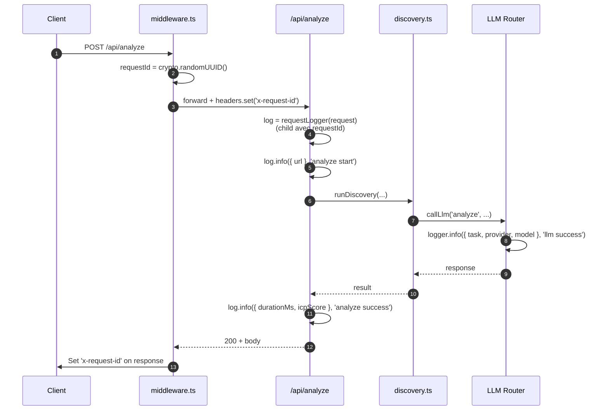

Tous les logs d'une même requête partagent le `requestId` → un seul filtre dans Axiom suffit pour reconstituer la trace.

---

## 14. Sécurité applicative

Scout suit une approche **défense en profondeur** : plusieurs couches indépendantes, aucune n'est suffisante seule, mais ensemble elles couvrent l'essentiel des attaques classiques sur une app B2B.

### Vue d'ensemble

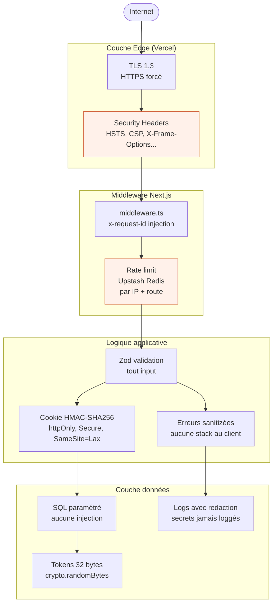

### Rate limiting

Implémentation : **Upstash Redis** (sliding window) appliqué par IP et par route, configuré dans [src/lib/rate-limit.ts](src/lib/rate-limit.ts).

| Route | Limite | Justification |
|---|---|---|
| `POST /api/analyze` | 10 req / heure / IP | Coût LLM élevé (3-7k tokens par requête) |
| `POST /api/generate-signals` | 10 req / heure / IP | Coût LLM élevé |
| `POST /api/subscribe` | 5 req / heure / IP | Anti-spam Resend + protection DB |
| `GET /api/me` | 60 req / minute / IP | Très bon marché, blocage du scan agressif |
| `GET /api/verify` | non limité | Token unique = anti-abuse natif |

Quand un quota est atteint, l'API renvoie HTTP **429** avec un `Retry-After` header et un message français propre. En l'absence de variables Upstash en dev local, le rate limiting est silencieusement désactivé (utile pour itérer rapidement sans dépendance externe).

### Security headers HTTP

Configurés dans [next.config.ts](next.config.ts), appliqués globalement à toutes les routes.

| Header | Valeur | Protection contre |
|---|---|---|
| `Strict-Transport-Security` | `max-age=63072000; includeSubDomains; preload` | Stripping HTTPS (downgrade attacks) |
| `X-Frame-Options` | `DENY` | Clickjacking (iframe sur des sites tiers) |
| `X-Content-Type-Options` | `nosniff` | MIME sniffing → XSS via type spoofing |
| `Referrer-Policy` | `strict-origin-when-cross-origin` | Fuite d'URL et paramètres sensibles dans les referrers cross-domain |
| `Permissions-Policy` | `camera=(), microphone=(), geolocation=(), interest-cohort=(), browsing-topics=()` | Désactive les APIs sensibles non utilisées + opt-out du FLoC/Topics tracking |
| `X-DNS-Prefetch-Control` | `off` | Fuites d'info via DNS prefetch automatique |
| `Content-Security-Policy` | `default-src 'self'; ...` | XSS, injection de scripts, chargement de ressources tierces non maîtrisées |

Une fois déployée, l'app est notée sur [securityheaders.com](https://securityheaders.com) — l'objectif est un A ou A+.

### Récapitulatif des protections

| Vecteur d'attaque | Mesure | Référence code |
|---|---|---|
| Brute force / abus de quota | Rate limiting par IP | [src/lib/rate-limit.ts](src/lib/rate-limit.ts) |
| XSS | React escape par défaut + CSP strict | [next.config.ts](next.config.ts) |
| Clickjacking | `X-Frame-Options: DENY` + CSP `frame-ancestors 'none'` | [next.config.ts](next.config.ts) |
| Vol de session XSS | Cookie httpOnly | [src/lib/session.ts](src/lib/session.ts) |
| Forgerie de session | Signature HMAC-SHA256 + comparaison `timingSafeEqual` | [src/lib/session.ts](src/lib/session.ts) |
| MITM / downgrade HTTPS | HSTS + cookie `Secure` (prod) | [next.config.ts](next.config.ts) |
| CSRF | Cookie `SameSite=Lax` | [src/lib/session.ts](src/lib/session.ts) |
| SQL injection | Tagged templates (driver Neon paramétré) | [src/server/subscribers/store.ts](src/server/subscribers/store.ts) |
| Open redirect | Redirections vers URL fixe (`/verified`) | [src/app/api/verify/route.ts](src/app/api/verify/route.ts) |
| Injection via input | Validation Zod sur tous les payloads | Routes `/api/*` |
| Fuite de stack trace | Erreurs sanitizées en messages FR | Toutes les routes |
| Fuite de secret dans logs | Redaction `pino` (`password`, `token`, `apiKey`...) | [src/lib/logger.ts](src/lib/logger.ts) |
| Tampering localStorage | Pas de session en localStorage (cookie httpOnly uniquement) | [src/lib/verified-email.ts](src/lib/verified-email.ts) |
| Phishing via email forgé | Double opt-in (preuve de contrôle de la boîte) | [src/app/api/verify/route.ts](src/app/api/verify/route.ts) |

### Améliorations sécurité à venir (cf. section 23)

- Expiration des tokens de vérification (`expires_at` + check 24h)
- SSRF hardening dans `fetcher.ts` (blocage explicite de toutes les IPs privées RFC1918 + AWS metadata endpoint)
- Honeypot anti-bot sur le form email
- Dependabot + Snyk pour le monitoring continu des CVE
- Cloudflare Turnstile (CAPTCHA invisible) en production publique
- Audit `securityheaders.com` après déploiement Vercel

---

## 15. Base de données

Une seule table, schéma défini en SQL versionné dans `migrations/`.

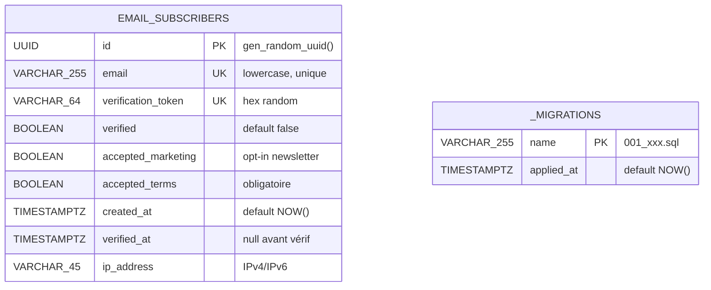

**Indexes** :

- `idx_subscribers_email` sur `email` — pour `/api/me` (lookup par email)
- `idx_subscribers_token` sur `verification_token` — pour `/api/verify` (lookup par token)

**Politique sur le token de vérification** :

- Re-soumission par un user pas encore vérifié → rotation du token (le précédent devient invalide)
- Re-soumission par un user déjà vérifié → token rotaté aussi → permet de poser un cookie sur un nouveau navigateur
- Tokens jamais en clair dans les logs, jamais retournés au client autrement que via l'URL signée envoyée par email

---

## 16. Structure du repo

```
scout/
├── middleware.ts                            # Injecte x-request-id sur /api/*
├── next.config.ts                           # Security headers HTTP globaux
├── migrations/
│   └── 001_email_subscribers.sql           # Schéma SQL versionné
├── scripts/
│   └── migrate.mjs                          # Runner de migrations (CLI)
├── public/
│   └── youno-logo.png                       # Logo HD utilisé dans l'email
├── src/
│   ├── app/
│   │   ├── api/
│   │   │   ├── analyze/route.ts             # POST analyse principale
│   │   │   ├── generate-signals/route.ts    # POST génération signaux Premium
│   │   │   ├── subscribe/route.ts           # POST inscription au gate
│   │   │   ├── verify/route.ts              # GET vérif token + set cookie
│   │   │   └── me/route.ts                  # GET statut session
│   │   ├── page.tsx                         # Home (mode Standard)
│   │   ├── premium/page.tsx                 # Mode Premium (4 étapes)
│   │   ├── results/page.tsx                 # Affichage du rapport
│   │   ├── verified/page.tsx                # Page après confirmation email
│   │   └── layout.tsx                       # Layout + polices
│   ├── components/
│   │   ├── analyze-form.tsx                 # Champ URL + bouton Analyser
│   │   ├── api-selector.tsx                 # Cases Clearbit/Hunter/CompanyEnrich
│   │   ├── email-gate-modal.tsx             # Modal du double opt-in
│   │   ├── hero-benefits.tsx                # 3 pills sous le hero
│   │   ├── premium-modal.tsx                # Modal "Passer en Premium"
│   │   ├── signals-selector.tsx             # 10 signaux toggleables (Standard)
│   │   ├── site-footer.tsx                  # Footer 2-col
│   │   ├── site-header.tsx                  # Header + bouton Premium
│   │   ├── premium/
│   │   │   ├── business-step.tsx            # Étape 2 : textarea description
│   │   │   ├── custom-signal-card.tsx       # Carte d'un signal généré
│   │   │   ├── premium-stepper.tsx          # Stepper 1→2→3→4
│   │   │   ├── run-step.tsx                 # Étape 4 : récap + APIs + lancement
│   │   │   └── signals-step.tsx             # Étape 3 : édition NL + grille
│   │   ├── result/
│   │   │   ├── company-header.tsx           # Logo + nom + URL en haut
│   │   │   ├── contacts-card.tsx            # Emails + tels publics
│   │   │   ├── description-card.tsx         # Brief commercial long
│   │   │   ├── enrichment-card.tsx          # Sections Hunter + CompanyEnrich
│   │   │   ├── legal-card.tsx               # Mentions légales extraites
│   │   │   ├── people-card.tsx              # Personnes mentionnées
│   │   │   ├── result-view.tsx              # Layout général du rapport
│   │   │   ├── score-card.tsx               # Score ICP + breakdown
│   │   │   ├── signals-card.tsx             # Liste des signaux détectés
│   │   │   └── tech-stack-card.tsx          # Stack technique par catégorie
│   │   └── ui/                              # Composants shadcn/ui
│   ├── lib/
│   │   ├── constants.ts                     # TECH_PATTERNS, SIGNAL_DEFINITIONS
│   │   ├── db.ts                            # Client Neon serverless
│   │   ├── format.ts                        # Helpers d'affichage
│   │   ├── logger.ts                        # Pino + requestLogger(request)
│   │   ├── rate-limit.ts                    # Upstash sliding window par IP
│   │   ├── result-store.ts                  # sessionStorage du résultat
│   │   ├── session.ts                       # HMAC sign/verify cookie
│   │   ├── types.ts                         # Schémas Zod + types TS
│   │   ├── utils.ts                         # cn() de shadcn
│   │   └── verified-email.ts                # Client fetchSession()
│   └── server/
│       ├── discovery.ts                     # Orchestrateur end-to-end
│       ├── enrichment/
│       │   ├── clearbit-logo.ts             # HEAD request
│       │   ├── company-enrich.ts            # GET + mapping defensive
│       │   ├── hunter.ts                    # GET + types Hunter
│       │   └── index.ts                     # runEnrichments parallèles
│       ├── llm/
│       │   ├── analyzer.ts                  # Brief LLM (task=analyze)
│       │   ├── providers.ts                 # Router multi-provider
│       │   └── signals-generator.ts         # Premium signals (task=signals)
│       ├── scoring/
│       │   └── icp-scorer.ts                # Score 0-100 explicable
│       ├── scraping/
│       │   ├── contacts.ts                  # mailto/tel + regex emails
│       │   ├── custom-signals.ts            # Détection signaux Premium
│       │   ├── extractor.ts                 # Extract HTML cheerio
│       │   ├── fetcher.ts                   # fetch borné + timeout
│       │   ├── legal-extractor.ts           # Mentions légales multi-pages
│       │   ├── signals.ts                   # 10 signaux Standard
│       │   └── tech-stack.ts                # ~50 patterns tech
│       └── subscribers/
│           ├── email.ts                     # Template HTML + envoi Resend
│           └── store.ts                     # CRUD email_subscribers
├── .env.local.example
├── package.json
├── tsconfig.json
└── README.md  ← vous y êtes
```

---

## 17. Lancer en local

### Prérequis

- **Node.js 20+** (testé sur 24)
- **npm 10+**
- Une instance Neon Postgres (pour le gate email)
- Au moins une clé LLM parmi : Groq, Mistral, Gemini, OpenRouter
- Une clé Resend + un domaine vérifié (pour les emails)

### Installation

```bash
git clone git@github.com:HamzaNADIFI07/Youno-Scout.git scout
cd scout
npm install
```

### Configuration

```bash
cp .env.local.example .env.local
# puis éditez .env.local avec vos vraies clés
```

Génération du `SCOUT_SESSION_SECRET` :

```bash
node -e "console.log(require('crypto').randomBytes(48).toString('hex'))"
```

### Migration de la base

```bash
npm run migrate
```

Output attendu :

```
→ 001_email_subscribers.sql (3 statements)
✓ 001_email_subscribers.sql appliqué

Terminé. 1 appliqué(s), 0 déjà appliqué(s).
```

### Lancement

```bash
npm run dev
```

L'application est disponible sur [http://localhost:3000](http://localhost:3000).

### Build production

```bash
npm run build
npm start
```

---

## 18. Migrations

Système simple, custom (pas de dépendance externe) :

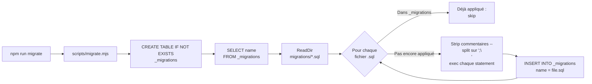

**Ajouter une nouvelle migration** :

1. Créer `migrations/002_xxx.sql` (numérotation strictement croissante)
2. `npm run migrate`
3. Les anciens fichiers déjà appliqués sont sautés, seul le nouveau s'exécute

---

## 19. Déploiement Vercel

1. Push le repo sur GitHub (si pas déjà fait)
2. Sur [vercel.com](https://vercel.com), "Import Project" → sélectionnez le repo
3. Framework auto-détecté : Next.js. Build command : `next build`. Output : `.next`
4. Dans "Environment Variables", ajoutez **les variables listées section 20**
5. **Important** : avant le premier déploiement, mettez à jour `NEXT_PUBLIC_APP_URL` avec l'URL Vercel (`https://votre-projet.vercel.app`)
6. Cliquez "Deploy"
7. Une fois déployé, exécutez la migration depuis votre machine locale (en pointant le `NEON_DATABASE_URL` du projet Vercel)
8. **Important** : dans Resend, vérifiez que le domaine de `RESEND_FROM_EMAIL` a son DKIM/SPF configuré, sinon les emails partent en spam
9. **Recommandé** : créez (gratuitement) une DB Upstash Redis sur [console.upstash.com](https://console.upstash.com) et collez `UPSTASH_REDIS_REST_URL` + `UPSTASH_REDIS_REST_TOKEN` dans les env vars Vercel. Sans ces deux variables, le rate limiting est désactivé silencieusement — l'app marche mais elle est exposée aux abus en prod.

---

## 20. Variables d'environnement

| Variable | Obligatoire | Valeur | Pour quoi |
|---|---|---|---|
| `GROQ_API_KEY` | Recommandée | `gsk_...` | LLM primaire (le plus rapide) |
| `OPENROUTER_API_KEY` | Optionnelle | `sk-or-v1-...` | Fallback LLM (3 modèles free internes) |
| `MISTRAL_API_KEY` | Optionnelle | hexa | Fallback LLM (qualité FR) |
| `GEMINI_API_KEY` | Optionnelle | `AIza...` | Fallback LLM (quota séparé) |
| `HUNTER_API_KEY` | Optionnelle | hexa | API Hunter (UI checkbox) |
| `COMPANY_ENRICH_API_KEY` | Optionnelle | str | API CompanyEnrich (UI checkbox) |
| `NEON_DATABASE_URL` | **Oui** | `postgresql://...` | Stockage email_subscribers |
| `RESEND_API_KEY` | **Oui** | `re_...` | Envoi email de vérification |
| `RESEND_FROM_EMAIL` | **Oui** | `contact@xxx.fr` | Adresse expéditrice (vérifiée dans Resend) |
| `NEXT_PUBLIC_APP_URL` | **Oui** | URL publique | Base des liens dans l'email + redirections |
| `SCOUT_SESSION_SECRET` | **Oui** | 64+ hex chars | Signature HMAC du cookie de session |
| `LOG_LEVEL` | Optionnelle | `info` / `debug` / etc | Niveau pino. Défaut : `debug` en dev, `info` en prod |
| `UPSTASH_REDIS_REST_URL` | Recommandée prod | `https://...upstash.io` | Rate limiting des routes API |
| `UPSTASH_REDIS_REST_TOKEN` | Recommandée prod | str | Token Upstash associé |

**Au minimum 1 clé LLM** parmi les 4 est requise sinon les analyses échoueront.

---

## 21. Tester l'API directement

```bash
# Test analyse standard (sans gate email — bypassable en dev en testant directement l'API)
curl -X POST http://localhost:3000/api/analyze \
  -H "Content-Type: application/json" \
  -d '{"url":"stripe.com","selectedSignals":["crm-used","funding-mention","international-presence"]}' | jq

# Test génération signaux Premium
curl -X POST http://localhost:3000/api/generate-signals \
  -H "Content-Type: application/json" \
  -d '{"description":"Notre offre: Cargo, plateforme GTM. ICP: scale-ups SaaS B2B 50-300 employés."}' | jq

# Test garde-fou anti-bullshit
curl -X POST http://localhost:3000/api/generate-signals \
  -H "Content-Type: application/json" \
  -d '{"description":"asdfasdf qwerqwer zzzz mmmmm"}' | jq
# → 422 + message "Votre description ne contient pas assez d'informations exploitables..."

# Inscription au gate
curl -X POST http://localhost:3000/api/subscribe \
  -H "Content-Type: application/json" \
  -d '{"email":"test@example.com","acceptedMarketing":true,"acceptedTerms":true}'
# → email envoyé via Resend, status: 'pending'

# Test du rate limiting (sans consommer de tokens LLM ni d'emails)
# Les 10 premières requêtes renvoient 400 (Zod rejette le payload vide),
# la 11e doit renvoyer 429 + header Retry-After.
for i in {1..11}; do
  curl -s -o /dev/null -w "Req $i: HTTP %{http_code}\n" \
    -X POST http://localhost:3000/api/generate-signals \
    -H "Content-Type: application/json" \
    -d '{}'
done
# Attendu :
# Req 1-10: HTTP 400
# Req 11:   HTTP 429
```

Pour reset le compteur de rate limit pendant les tests, allez sur Upstash Console → Data Browser → supprimer la clé `scout:rl:generate-signals:generate-signals:::1:*`.

---

## 22. Limites actuelles

- **SPA pures sans SSR** : si le HTML initial est quasi vide (Vue/React sans SSR), l'extraction retombe sur très peu de contenu et la qualité du brief baisse. Une étape "headless browser" (Playwright via Browserless ou Firecrawl) résoudrait ce point.
- **Crawl borné aux pages légales** : Scout n'explore que la home + jusqu'à 3 pages légales. Une exploration ciblée de `/pricing`, `/about`, `/customers`, `/careers` enrichirait les signaux GTM.
- **Détection tech sur patterns texte** : pas de fingerprinting réseau, pas d'analyse des `link rel=preconnect`, etc. Couvre les usages courants mais perfectible.
- **Pas de cache** : chaque requête refait l'analyse complète. En production sur Konsole, on stockerait la dernière analyse par domaine avec un TTL adaptatif.
- **ICP de référence unique** : le score est calibré sur "SaaS B2B mid-market". Une intégration produit permettrait de définir plusieurs profils ICP par compte client et de basculer dynamiquement.
- **OpenRouter free pool intermittent** : les modèles `:free` sont rate-limités à l'échelle du provider upstream (Venice notamment). Notre router gère le fallback automatiquement, mais OR n'est jamais une source fiable seule.
- **Gate email bloquante** : un user qui change de boîte mail doit re-confirmer. Acceptable pour la démo, à revoir en production (cookie longue durée + refresh discret).
- **Pas de cache résultat par domaine** : refaire la même analyse refait tout le travail. Une couche Vercel KV (ou Redis) avec TTL adaptatif éviterait ça en prod.

---

## 23. Pistes d'amélioration

- Exploration multi-page avec un crawl borné (3 à 5 pages max)
- Mise en cache par domaine sur Vercel KV avec invalidation manuelle
- Détection passive de signaux additionnels (levée de fonds via NewsAPI, offres d'emploi via Indeed/LinkedIn)
- Export vers HubSpot ou Attio en un clic via une HubSpot UI Extension côté CRM
- Comparaison de deux comptes côte à côte
- Historique de recherches récentes par utilisateur en base
- Streaming des résultats partiels pendant l'analyse (Server-Sent Events)
- Tests d'intégration sur quelques URLs de référence (Playwright)
- Authentification complète et quotas par utilisateur pour usage interne
- Webhook vers Slack quand un score > 80 est détecté

---

## 24. Pertinence pour Konsole

Scout est pensé à la fois comme **un module de Konsole** et comme **un canal d'acquisition** pour Youno. Cette double-vocation est volontaire — elle s'inscrit dans la stratégie Product-Led Growth qui domine l'acquisition B2B SaaS depuis 5 ans[^openview].

### 23.1 Scout dans le funnel AARRR de Youno

Le funnel AARRR (Acquisition → Activation → Rétention → Référence → Revenu)[^aarrr] permet de positionner clairement où Scout intervient dans la machine commerciale Youno :

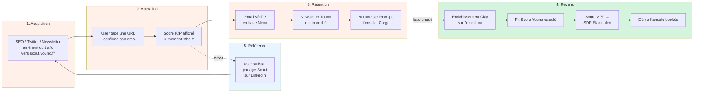

### 23.2 Intégration technique dans Konsole

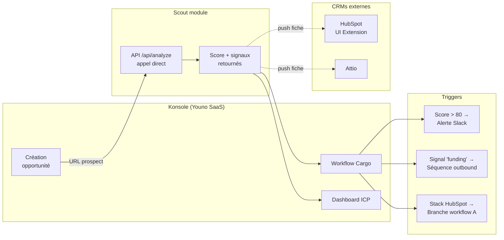

**Intégrations naturelles** :

- **Appel API depuis Konsole** vers `/api/analyze` lors de la création d'un compte ou d'une opportunité — le rapport remonte automatiquement
- **Score ICP + signaux + stack** poussés dans la fiche compte HubSpot via une HubSpot UI Extension (Youno développe déjà ce type d'extension)
- **Workflow Cargo** se déclenche sur certains signaux pour activer une séquence outbound dédiée — exemple : "vient de lever Series B" + "utilise HubSpot" → séquence "Partner with HubSpot, accélérer votre RevOps"
- **Personnalisation ICP** : dans Konsole, l'utilisateur définit ses propres signaux et ICP cible (déjà fait dans le mode Premium de Scout). Konsole les passe à Scout via l'API
- **Multi-tenant** : chaque tenant Konsole a son propre profil ICP, ses signaux custom, et son historique d'analyses

Scout reste **léger et stateless** côté business : il fait l'analyse, retourne le rapport, point. La logique de workflow et de stockage reste dans Konsole, où elle a sa place.

### 23.3 Synthèse : pourquoi cette approche bat un "simple outil utilitaire"

| Critère | Outil utilitaire sans gate | Scout avec Engineering as Marketing |
|---|---|---|
| Trafic | Anonyme | Identifié (email vérifié) |
| Sortie business | Rien | Lead qualifié + intent signal + enrichissement déclenchable |
| Intégration Konsole | Aucune | Brique TOFU du funnel global |
| Apport à Youno | Brand awareness | **Pipeline réel** (leads, démos bookées) |
| Positionnement | Outil isolé | Première brique du funnel Youno |

L'intention produit derrière Scout : ne pas se limiter à un outil qui répond à un besoin ponctuel, mais en faire **une brique du business de Youno** qui alimente Konsole en leads qualifiés dès l'entrée du funnel.

---

## Sources et références

[^em]: **Engineering as Marketing** — Gabriel Weinberg & Justin Mares, *Traction: How Any Startup Can Achieve Explosive Customer Growth*, Portfolio (2015), chapitre 14. Le concept est repris dans la majorité des frameworks B2B growth modernes (First Round, Reforge, GrowthHackers).

[^hubspot]: **HubSpot Website Grader** — [websitegrader.com](https://websitegrader.com). Outil gratuit lancé en 2007 par Dharmesh Shah (CTO HubSpot). Une étude de cas de HubSpot rapporte plusieurs millions de leads générés depuis le lancement, devenu canal d'acquisition de référence cité dans le livre *Inbound Marketing* (Halligan & Shah, Wiley, 2009).

[^6sense]: **Signal-Based Selling** — [6sense, *The State of Predictable Revenue Report* (2024)](https://6sense.com/resources/). Les éditeurs B2B qui exploitent des signaux d'intention voient en moyenne +35 % de win rate sur leur pipeline outbound.

[^clay]: **Clay** — [clay.com](https://clay.com). Plateforme d'enrichissement et orchestration go-to-market utilisée par OpenAI, Notion, Vercel, Anthropic. Levée Series B de 46 M$ en 2024. Permet d'enrichir un simple email pro avec 100+ champs en quelques secondes.

[^aarrr]: **AARRR Pirate Metrics** — Dave McClure (500 Startups), *Startup Metrics for Pirates*, présentation Startonomics 2007 ([slides](https://www.slideshare.net/dmc500hats/startup-metrics-for-pirates-long-version)). Framework devenu standard pour structurer un funnel d'acquisition / activation / rétention / revenu / référence.

[^plg]: **Product-Led Growth** — Wes Bush, *Product-Led Growth: How to Build a Product That Sells Itself*, Product-Led Institute (2019). Le PLG consiste à utiliser le produit lui-même comme principal moteur d'acquisition, de conversion et d'expansion.

[^openview]: **OpenView 2024 Product-Led Growth Index** — [openviewpartners.com/product-benchmarks/](https://openviewpartners.com/product-benchmarks/). Sur >900 SaaS B2B étudiés, 58 % déclarent que le PLG est leur premier canal d'acquisition en 2024 (vs. 38 % en 2021).
